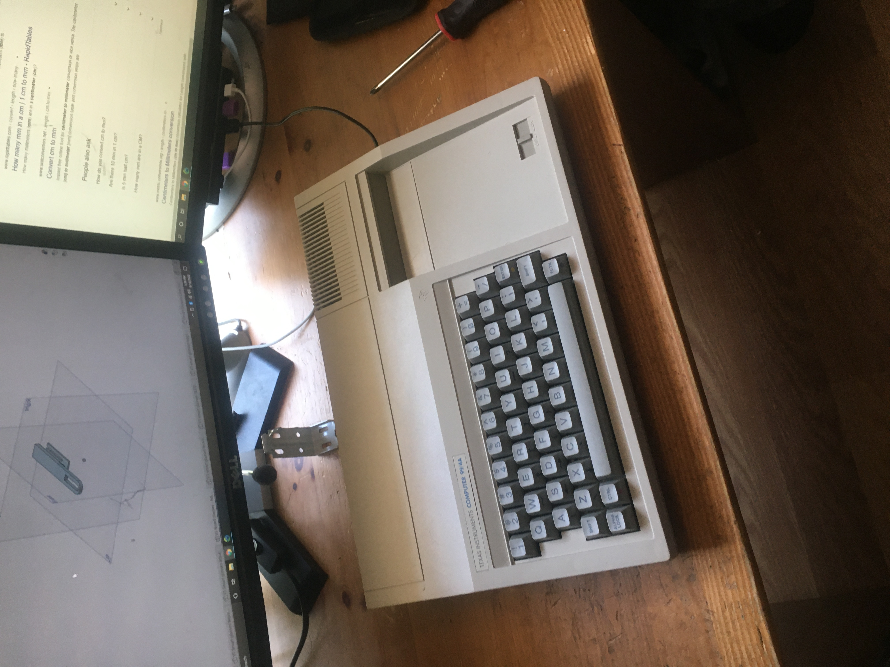
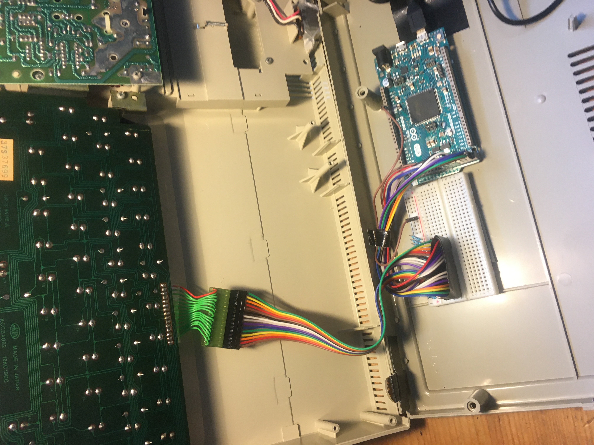

# TI-99-4A-arduino-keyboard-
This rep stores the arduino code meant for converting the TI 99 4A keyboard into a funcitonal USB keyboard! Note that this code was specifically written to avoid the wire bouncing code on this site: https://github.com/matthewepler/raspTI_keyboard/blob/master/raspTI_keyboard.ino.

This works with any arduino with a native usb (see arduino due for example) so Keyboard.h will work. Teensy is not tested but likely will work too.

# Images:

exterior

exterior

